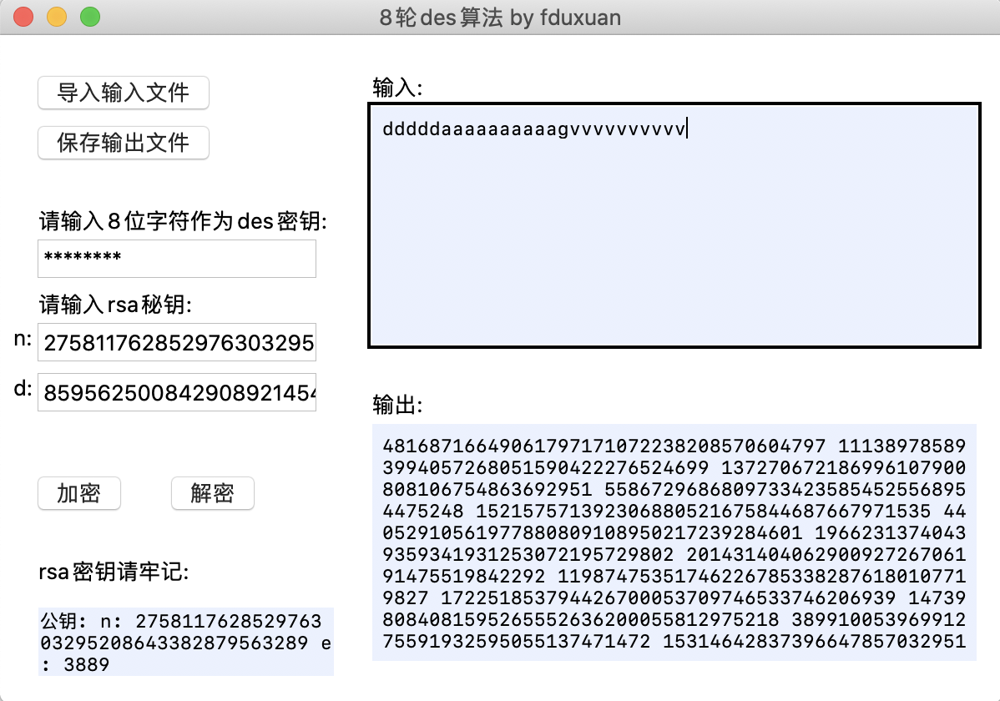
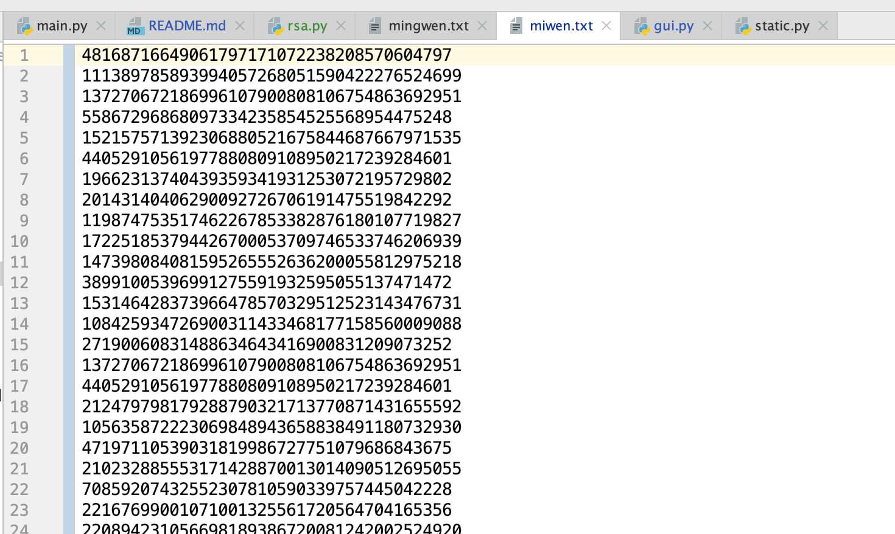
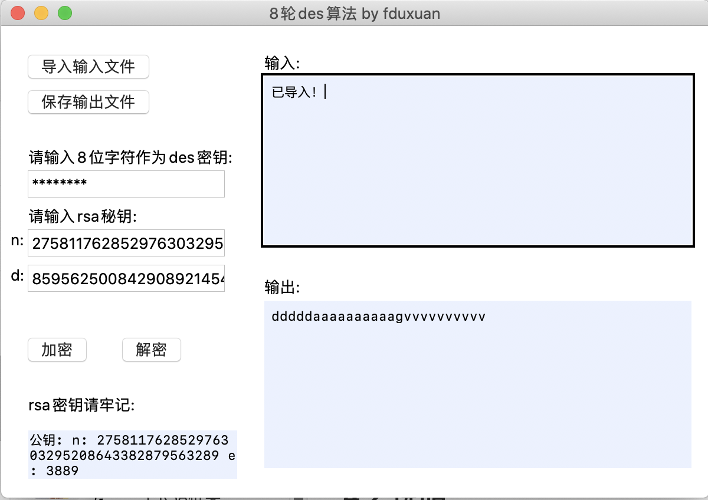

# RSA+8轮DES的编程实现

**复旦大学计算机科学与技术    16307130335      方煊杰**


## 1. DES框架

### 1.1 初始置换

因为在des中置换过程较多，因此将置换泛化封装于swap函数，方便后续各个步骤调用。

```python
# 初始置换
# res, res_l, res_r = swap(data, IP)
IP = [58,50,42,34,26,18,10,2,
      60,52,44,36,28,20,12,4,
      62,54,46,38,30,22,14,6,
      64,56,48,40,32,24,16,8,
      57,49,41,33,25,17, 9,1,
      59,51,43,35,27,19,11,3,
      61,53,45,37,29,21,13,5,
      63,55,47,39,31,23,15,7]

# 置换,合并初始值换/子密钥的置换
def swap(data, table):
    # data为数组，内容为1/0
    length = len(table)
    res = [0]*length
    for i in range(length):
        res[i] = data[table[i]-1]
    return res, res[0:int(length/2)], res[int(length/2):]
```


### 1.2  加密处理--迭代过程

这里实现的时8轮des算法，所以迭代总共处理8轮：

```python
    for i in range(8):
        new_L = R
        # f函数
        new_R = xor(L, f_func(R, sub_keys[i]))
        L = new_L
        R = new_R
```

写作公式即为：
$$
Ln = R_{n-1} \  \ , \ Rn = L_{n-1} \ 异或 \ f(R_{n-1}, key_{n-1})
$$

#### 1.2.1 函数f

函数f由四步运算构成：扩展置换；异或；S-盒代替；P-盒置换。

输出为 Rn, Kn

```python
# f函数，输入为rn,kn
def f_func(R, K):
    # 扩展置换
    r, r_l, r_r = swap(R, E)
    # 异或
    r = xor(r, K)
    ans = []
    # s盒置换
    for i in range(8):
        ans += calculate_s(r[i*6: i*6+6], i)
    # p盒置换
    res, res_l, res_r = swap(ans, P_box)
    return res
```

####  

##### 1.2.1.1  扩展置换E

通过扩展置换E，数据的右半部分Rn从32位扩展到48位。扩展置换改变了位的次序，重复了某些位。

```python
# 扩展置换表
# res, res_l, res_r = swap(Rn, E)
E = [32,1, 2, 3, 4, 5,
     4, 5, 6, 7, 8, 9,
     8, 9, 10,11,12,13,
     12,13,14,15,16,17,
     16,17,18,19,20,21,
     20,21,22,23,24,25,
     24,25,26,27,28,29,
     28,29,30,31,32,1 ]
```

##### 1.2.1.2 异或

Rn扩展置换之后与子秘钥Kn异或以后的结果作为输入块进行S盒代替运算

定义数组的xor函数方便调用

```python
def xor(list1, list2):
    res = []
    for i in range(len(list1)):
        res.append(list1[i]^list2[i])
    return res
```

##### 1.2.1.3 S-盒代替(功能表S盒)

功能是把48位数据变为32位数据

代替运算由8个不同的代替盒(S盒)完成。每个S-盒有6位输入，4位输出。

所以48位的输入块被分成8个6位的分组，每一个分组对应一个S-盒代替操作。

经过S-盒代替，形成8个4位分组结果。

```python
# 计算S盒步骤，输入为data和第几个盒
def calculate_s(data, num):
    row = data[0]*2 + data[5]
    col = data[1]*8 + data[2]*4 + data[3]*2 + data[4]
    res = S_box[num][row][col]
    ans = [0, 0, 0, 0]
    # 得到二进制
    for i in range(4):
        ans[3-i] = (res >> i) & 1
    return ans
```

##### 1.2.1.4 P盒置换

```python
# P盒置换
# res, res_l, res_r = swap(S_box_out, P_box)
P_box = [16,7,20,21,29,12,28,17,1,15,23,26,5,18,31,10,
         2,8,24,14,32,27,3,9,19,13,30,6,22,11,4,25]
```


#### 1.2.2 生成子密钥

- 把密钥的奇偶校验位忽略不参与计算，即每个字节的第8位，将64位密钥降至56位，然后根据选择置换PC-1将这56位分成两块C(28位)和D(28位)；
- 将C和D进行循环左移变化(注：每轮循环左移的位数由轮数决定)，变换后生成C0和D0，然后C0和D0合并，并通过选择置换PC-2生成子密钥K0(48位)；
- C0和D0再次经过循环左移变换，生成C1和D1，然后C1和D1合并，通过选择置换PC-2生成密钥K1(48位)；
- 以此类推，得到K7(48位)。

```python
# 生成子密钥，输入为密钥
def get_sub_key(key):
    # 变换为56位
    C_D, C, D = swap(key, PC_1)
    sub_key = []
    # 8 轮变换
    for i in range(0, 8):
        C = shift_left(C, shift_count[i])
        D = shift_left(D, shift_count[i])
        k, k_left, k_right = swap(C + D, PC_2)
        sub_key.append(k)
    return sub_key
```

##### 1.2.2.1 密钥置换选择1---PC-1

操作对象是64位秘钥

64位秘钥降至56位秘钥不是说将每个字节的第八位删除，而是通过缩小选择换位表1（置换选择表1）的变换变成56位

```python
# 置换选择表1
# C_D, C, D = swap(key, PC_1)
PC_1 = [57,49,41,33,25,17,9, 1,
        58,50,42,34,26,18,10,2,
        59,51,43,35,27,19,11,3,
        60,52,44,36,63,55,47,39,
        31,23,15,7, 62,54,46,38,
        30,22,14,6, 61,53,45,37,
        29,21,13,5, 28,20,12,4]
```

##### 1.2.2.2  循环左移

根据轮数，将Cn和Dn分别循环左移1位或2位

```python
# 每轮循环左移位数
shift_count = [1,1,2,2,2,2,2,2,
               1,2,2,2,2,2,2,1]
              
# 左移
def shift_left(data, num):
    length = len(data)
    res = [0] * length
    for i in range(-num, length-num):
        res[i] = data[i+num]
    return res
```

##### 1.2.2.3 密钥置换选择2

 Cn和Dn合并之后，再经过置换选择表2生成48位的子秘钥Kn

```python
# 置换选择表2
# k, k_left, k_right = swap(C + D, PC_2)
PC_2 = [14,17,11,24,1, 5,
        3, 28,15,6, 21,10,
        23,19,12,4, 26,8,
        16,7, 27,20,13,2,
        41,52,31,37,47,55,
        30,40,51,45,33,48,
        44,49,39,56,34,53,
        46,42,50,36,29,32]
```


### 1.3 逆置换

将L8, R8作为输入块，进行逆置换得到最终的密文输出块

```python
# 逆置换
# res, l, r = swap(L+R, IP_1)
IP_1 = [40,8,48,16,56,24,64,32,39,7,47,15,55,23,63,31,
        38,6,46,14,54,22,62,30,37,5,45,13,53,21,61,29,
        36,4,44,12,52,20,60,28,35,3,43,11,51,19,59,27,
        34,2,42,10,50,18,58,26,33,1,41, 9,49,17,57,25]
```


### ps 解密处理

解密处理与加密处理步骤完全一致，唯一要修改的地方在于迭代地方：

```python
    if mode == 0:
    		# 原来的subkeys要逆序
        sub_keys.reverse()
        for i in range(8):
            new_R = L
            # f函数
            new_L = xor(R, f_func(L, sub_keys[i]))
            L = new_L
            R = new_R
```

$$
Rn =L_{n-1} \  \ , \ Ln = R_{n-1} \ 异或 \ f(L_{n-1}, key_{n-1})
$$


## 2. CBC模式

### 2.1加密步骤如下：

1）首先将数据按照8个字节一组进行分组得到D1D2......Dn（若数据不是8的整数倍，用指定的PADDING数据补位）

2）第一组数据D1与初始化向量I异或后的结果进行DES加密得到第一组密文C1（初始化向量I为全零）

3）第二组数据D2与第一组的加密结果C1异或以后的结果进行DES加密，得到第二组密文C2

4）之后的数据以此类推，得到Cn

5）按顺序连为C1C2C3......Cn即为加密结果。

 

### 2.2 解密是加密的逆过程

1）首先将数据按照8个字节一组进行分组得到C1C2C3......Cn

2）将第一组数据进行解密后与初始化向量I进行异或得到第一组明文D1（注意：一定是先解密再异或）

3）将第二组数据C2进行解密后与第一组密文数据进行异或得到第二组数据D2

4）之后依此类推，得到Dn

5）按顺序连为D1D2D3......Dn即为解密结果。

```python
    for byte in group:
        text = init_batch(byte)
        if mode == 1:
            text = xor(text, IV)
            res = encrypt_decrypt(key, text, mode)
            IV = res
        else:
            res = encrypt_decrypt(key, text, mode)
            res = xor(res, IV)
            IV = text

```


## 3. RSA框架

### 3.1 大质数的生成

采用米勒-拉宾素性检测来判断随机生成的是否为素数。

```python
# 检测大整数是否是素数,如果是素数,就返回True,否则返回False
def rabin_miller(num):
    s = num - 1
    t = 0
    while s % 2 == 0:
        s = s // 2
        t += 1

    for trials in range(5):
        a = random.randrange(2, num - 1)
        v = pow(a, s, num)
        if v != 1:
            i = 0
            while v != (num - 1):
                if i == t - 1:
                    return False
                else:
                    i = i + 1
                    v = (v ** 2) % num
    return True
```

米勒-拉宾素性检测主要基于：

**如果p是素数，x是小于p的正整数，且x^2 = 1 mod p，则x要么为1，要么为p-1。**

由于这需要数论证明，所以在这里就不证明了。

```python
def get_prime(key_size=64):
  while True:
    num = random.randrange(2 ** (key_size - 1), 2 ** key_size)
    if is_prime(num):
      return num
```


### 3.2 生成密钥

生成两个64位的P,Q之后，再进行rsa算法生成密钥：

```python
def gen_key(p, q):
  n = p * q
  fy = (p - 1) * (q - 1)   # 计算与n互质的整数个数 欧拉函数
  e = 3889          # 选取e  一般选取65537
  # generate d
  a = e
  b = fy
  r, x, y = ext_gcd(a, b)
  print(x)  
  d = x
  # 返回：  公钥   私钥
  return  (n, e), (n, d)
```

这里采用了扩展欧几里的算法：

```python
# 计算 ax + by = 1中的x与y的整数解（a与b互质）
def ext_gcd(a, b):
  if b == 0:
    x1 = 1
    y1 = 0
    x = x1
    y = y1
    r = a
    return r, x, y
  else:
    r, x1, y1 = ext_gcd(b, a % b)
    x = y1
    y = x1 - a // b * y1
    return r, x, y

```


### 3.3 加解密

```python
# 加密 m是被加密的信息 加密成为c
def encrypt(m, pubkey):
  n = pubkey[0]
  e = pubkey[1]
  c = exp_mode(m, e, n)
  return c


# 解密 c是密文，解密为明文m
def decrypt(c, selfkey):
  n = selfkey[0]
  d = selfkey[1]
  m = exp_mode(c, d, n)
  return m

```


## 4 使用说明

### 4.1 界面设计

采用tkinker简单设计



保存为miwen.txt：




再导入密文进行解密：




### 4.2 说明

* 对输入先进行CBC模式的链式加密，再对加密后每8个字节的askii进行rsa加密

- 可以在输入框中直接输入要加密的字符串（为了显示方便，所以并不读取二进制文件而是原本的字符）

- 输出显示为解密后原本输入或者加密后的int型数据

- 支持导入文件

- 运行方式： 在unix条件下的可执行文件：

  支持mac和linux

  ```shell
  # 在dist文件夹下
  $ cd dist 
  $ ./gui
  ```

  也可以执行python‘文件

  ```shell
  $ python3 gui.py
  ```

  


